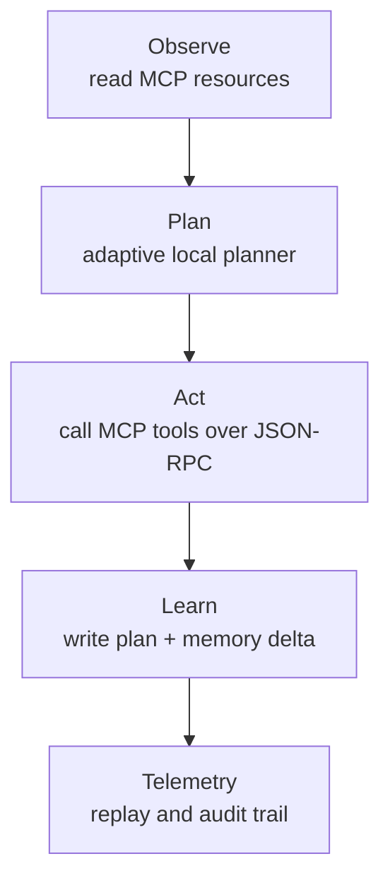

<table width="100%">
<tr>
<td style="vertical-align: top;">

<h1>The AI Engineer — Capstone Projects</h1>

This repository consolidates four weekly capstones from <i>The AI Engineer</i> program.

Weeks 1–3 are notebook-centered ML/DL deliverables.  
Week 4 is an MCP-based agentic systems capstone whose <b>primary submission path</b> is the remote MCP server/client workflow, with a local deterministic mirror retained as supporting evidence for replay, debugging, and reviewer validation.

</td>

<td align="right" width="200">
  
</td>
</tr>
</table>

<p align="center">
  
  
  
  
</p>

---

## Week 4 MCP Workflow



Weeks 1–3 build the foundations for Week 4:

* Week 1: optimization and gradient-based learning
* Week 2: backpropagation and PyTorch training loops
* Week 3: attention, transformers, and tiny LLM building blocks
* Week 4: MCP-based agentic orchestration with telemetry, replay, and memory

---

## Weekly Capstones Overview

| Week  | Capstone                          | Primary artifact                                                                                                                                                                                                                                                                                                                                                                                                              | Access / delivery mode                                                                                                                                                                              |
| ----- | --------------------------------- | ----------------------------------------------------------------------------------------------------------------------------------------------------------------------------------------------------------------------------------------------------------------------------------------------------------------------------------------------------------------------------------------------------------------------------- | --------------------------------------------------------------------------------------------------------------------------------------------------------------------------------------------------- |
| **1** | **Gradient Descent Optimization** | [`gd_capstone.ipynb`](capstones/week01_gd_optimization/gd_capstone.ipynb)                                                                                                                                                                                                                                                                                                                                                     | Colab-ready notebook — [Open in Colab](https://colab.research.google.com/github/FranQuant/the_ai_engineer_capstones/blob/main/capstones/week01_gd_optimization/gd_capstone.ipynb)                   |
| **2** | **Backpropagation**               | [`week02_master_capstone.ipynb`](capstones/week02_backprop/week02_master_capstone.ipynb)                                                                                                                                                                                                                                                                                                                                      | Colab-ready master notebook — [Open in Colab](https://colab.research.google.com/github/FranQuant/the_ai_engineer_capstones/blob/main/capstones/week02_backprop/week02_master_capstone.ipynb)        |
| **3** | **Tiny Transformer**              | [`mini_gpt_diagnostics.ipynb`](capstones/week03_transformers/mini_gpt_diagnostics.ipynb)                                                                                                                                                                                                                                                                                                                                      | Colab-ready diagnostics notebook — [Open in Colab](https://colab.research.google.com/github/FranQuant/the_ai_engineer_capstones/blob/main/capstones/week03_transformers/mini_gpt_diagnostics.ipynb) |
| **4** | **Agentic Incident Command**      | [`README_week04_capstone.md`](capstones/week04_agentic_incident_command/README_week04_capstone.md) · [`demo_remote.py`](capstones/week04_agentic_incident_command/02_incident_command_agent/demo_remote.py) · [`remote_agent.py`](capstones/week04_agentic_incident_command/02_incident_command_agent/remote_agent.py) · [`mcp_server.py`](capstones/week04_agentic_incident_command/02_incident_command_agent/mcp_server.py) | Local MCP workflow. The remote MCP path is the primary graded artifact; the local deterministic runner is supporting evidence.                                                                      |

---

## Repository Structure

Reviewer-facing entrypoints:

```text
the_ai_engineer_capstones/
├── README.md
├── requirements.txt
├── assets/
│   ├── mcp_server_startup.png
│   ├── remote_opal_loop.png
│   ├── tae_logo.png
│   └── telemetry_jsonl_confirmation.png
└── capstones/
    ├── week01_gd_optimization/
    │   ├── gd_capstone.ipynb
    │   └── README_week01_capstone.md
    ├── week02_backprop/
    │   ├── week02_master_capstone.ipynb
    │   └── README_week02_capstone.md
    ├── week03_transformers/
    │   ├── mini_gpt_diagnostics.ipynb
    │   ├── train_mini_gpt.py
    │   └── README_week03_capstone.md
    └── week04_agentic_incident_command/
        ├── README_week04_capstone.md
        ├── artifacts/
        │   └── telemetry.jsonl
        └── 02_incident_command_agent/
            ├── config.py
            ├── demo_remote.py
            ├── remote_agent.py
            ├── mcp_server.py
            ├── mcp_client.py
            ├── cli.py
            ├── replay.py
            └── test_tools.py
```

---

## Week 4 Verification Entry Points

From the repository root:

```bash
# Terminal A: start the MCP server
python capstones/week04_agentic_incident_command/02_incident_command_agent/mcp_server.py

# Terminal B: run the primary graded remote MCP path
python capstones/week04_agentic_incident_command/02_incident_command_agent/demo_remote.py

# Replay a telemetry trace
python capstones/week04_agentic_incident_command/02_incident_command_agent/cli.py --replay capstones/week04_agentic_incident_command/artifacts/telemetry.jsonl

# Supporting deterministic local run
python capstones/week04_agentic_incident_command/02_incident_command_agent/cli.py
```

For Week 4 details, telemetry, guardrails, and architecture notes, see the dedicated Week 4 README:
[`capstones/week04_agentic_incident_command/README_week04_capstone.md`](capstones/week04_agentic_incident_command/README_week04_capstone.md)

---

## Environment & Reproducibility

This repository uses a lightweight **pip + venv** workflow and targets **Python 3.11**.

```bash
python3 -m venv .venv
source .venv/bin/activate
pip install -r requirements.txt
```

Notes:

* Weeks 1–3 can be reviewed directly in GitHub and opened in Colab from the links above.
* Week 4 is designed for a local Python environment because it depends on a live MCP server/client interaction and replayable telemetry artifacts.

---

## License (Educational Use)

All content in this repository is provided **for educational and illustrative purposes only**.
No guarantees are made regarding correctness, performance, reliability, or suitability for any production environment.

---

## Agentic Systems Notice

Agentic systems — especially those capable of taking actions, orchestrating tools, or modifying state — can introduce significant safety risks.

Before using any such system outside a controlled environment:

* validate outputs manually
* run code inside a sandboxed environment
* apply strict guardrails and permissions
* do not connect an agent to real infrastructure without explicit safety checks

Use responsibly.

© 2025 Francisco Salazar
