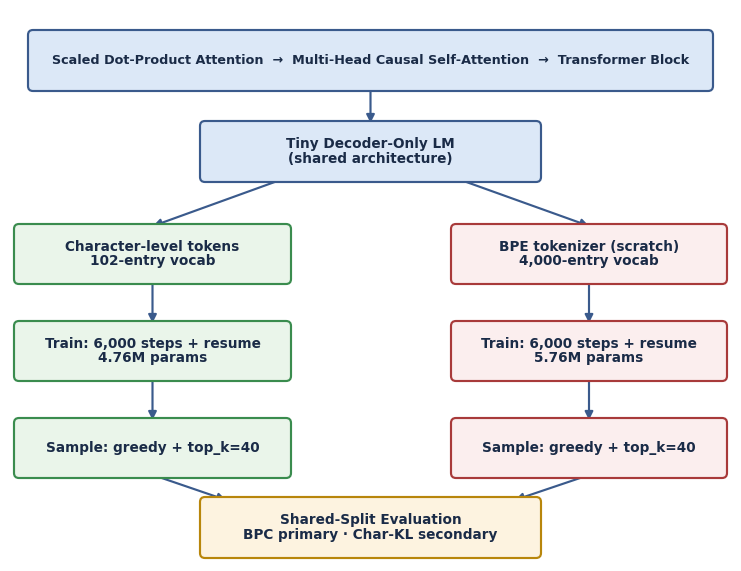

# Week 3 Capstone — Building a Decoder-Only Transformer from Scratch on FOMC Text

This capstone builds and trains a small decoder-only Transformer from scratch in
PyTorch on FOMC statements and minutes from 2010 through April 2026. Scaled
dot-product attention, causal masking, multi-head attention, positional encoding,
Transformer blocks, training, checkpointing, and autoregressive generation are
implemented directly, without Transformer libraries.

The core model uses character-level tokenization. A separate BPE extension tests
tokenization efficiency under the same raw-text split, Transformer depth and
width, block size, and token-context budget. Final comparison uses deterministic
unsmoothed held-out negative log-likelihood normalized to bits per character.

## What's inside

| Section | Contents |
|---|---|
| Attention & blocks | SDPA, causal mask, self-attn, multi-head attn — each numerically verified |
| Model | Decoder-only, weight-tied LM with cosine LR + resume phase |
| Training | `TRAIN=True` fresh-run default, local best-checkpoint tracking, lr/pre-clip-grad-norm logging |
| Sampling | Greedy + temperature, `top_k=40` |
| Extension | Train-only BPE fit, shared raw-text split, deterministic unsmoothed NLL/BPC comparison |

## Final results

| | Character-level | BPE |
|---|---|---|
| Parameters | 4,759,040 | 5,756,928 |
| Initial best smoothed validation CE | 1.261518 | 2.621752 |
| Resume best smoothed validation CE | 1.237127 | 2.551549 |
| Final unsmoothed held-out NLL | 573,632.875 | 458,539.46875 |
| **Final bits/character** | **1.2294** | **0.9828** |

**BPE achieves approximately 20.1% lower BPC.** Label-smoothed validation CE is
an optimization diagnostic; deterministic unsmoothed held-out NLL/BPC is the
final tokenizer-comparison metric.

Neither model writes fully coherent prose at this scale — expected. Samples
do use real FOMC names and correct procedural/policy language.

## Pipeline

Every stage is verified against a hand-computable example before the next is
built on top of it. Both tokenizers use the same contiguous 90/10 raw-text
split, and BPE merge rules/vocabulary are fit on training text only. The models
share Transformer depth, width, block architecture, and token-context budget.
They do not have equal parameter counts or raw-character context spans:
the BPE tied embedding/output matrix is larger, and each BPE token typically
spans multiple characters.

## Corpus

`fomc_training_corpus.txt` — 210 docs (93 statements + 117 minutes,
2010–2026), 6.73M chars. Built by `build_fomc_corpus.py` /
`build_fomc_minutes_corpus.py` / `merge_fomc_corpus.py`; provenance in
`fomc_training_corpus_manifest.json`.

Pre-2010 minutes aren't included — they live under a legacy URL scheme on the
Fed's site that this corpus's builder doesn't crawl (disclosed in the
manifest's `known_coverage_gap`). Seven validation characters are unseen during
BPE fitting and map to `<unk>`.

## Run it

Colab badge above → leave the fresh-run default `TRAIN = True` → Run All. The
notebook self-fetches the corpus and generates local checkpoints and final
char/BPE JSON run records after deterministic evaluation. No upload is needed.

**Fresh Colab execution on NVIDIA L4: 33 min 52 s.**

Set `TRAIN = False` only to skip both character and BPE training/resume phases.
In that mode, checkpoint-dependent sections run only when compatible local
checkpoints already exist; missing checkpoints produce informative skip messages.

## Methodology notes

- Final BPC uses summed unsmoothed held-out NLL over deterministic overlapping
  windows (`block_size=256`, `stride=128`), scoring each target once.
- Both systems use the same contiguous 90/10 raw-text split; BPE is fit only on
  training text. Training diagnostics retain label smoothing.
- Depth, width, block size, and token-context budget are shared, but BPE has more
  vocabulary-dependent parameters and a longer effective raw-character context.
- Weight decay was not isolated in a controlled ablation, so its effect remains
  a hypothesis rather than a causal conclusion.
- Results use `seed=1`; multi-seed uncertainty and larger-model ablations remain
  future work. Char-KL is a secondary generation statistic.
