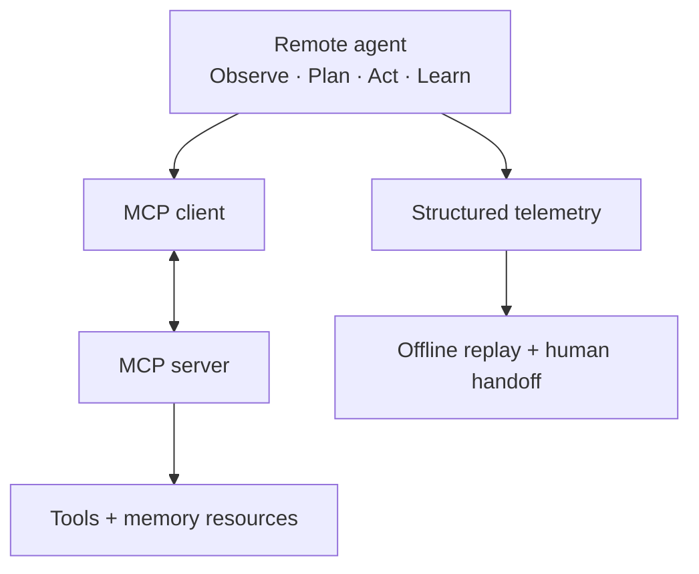

# Week 04 Capstone: Agentic Incident Command

An auditable incident-response agent built around an **Observe–Plan–Act–Learn (OPAL)** loop and an MCP-style client/server workflow.

The primary submission is the remote agent in [`02_incident_command_agent/`](02_incident_command_agent/). It communicates with the MCP server over JSON-RPC/WebSockets, invokes tools under explicit guardrails, writes structured telemetry, and produces a human-readable incident handoff.

---

## Submission Overview

| Surface | Role |
| --- | --- |
| [`demo_remote.py`](02_incident_command_agent/demo_remote.py) | Primary remote MCP demonstration |
| [`mcp_server.py`](02_incident_command_agent/mcp_server.py) | Tools, resources, memory, and server-side budgets |
| [`remote_agent.py`](02_incident_command_agent/remote_agent.py) | OPAL orchestration and evidence-grounded handoff |
| [`telemetry.jsonl`](artifacts/telemetry.jsonl) | Replayable execution trace |
| [`sample_summary.md`](artifacts/sample_summary.md) | Human escalation artifact |

The local deterministic agent and `01_tool_harness/` are supporting validation components rather than the primary submission path.

---

## Architecture



The agent observes MCP resources, creates an evidence-driven plan, executes approved tools, records the complete lifecycle, and writes the resulting plan and incident delta back to server memory.

---

## Key Capabilities

- **Adaptive planning:** tool selection responds to observed incident evidence rather than returning one fixed plan.
- **MCP client/server workflow:** tools and `memory://` resources are accessed through JSON-RPC over WebSockets.
- **Guarded execution:** step, failure, latency, token, and descriptive dollar budgets constrain the action loop.
- **Traceable evidence:** correlation and loop identifiers connect client events, server events, tool results, and summaries.
- **Deterministic replay:** recorded JSONL events can be inspected without rerunning tools or reconstructing server state.
- **Human handoff:** each remote run produces an evidence-grounded incident summary suitable for escalation.

`config.py` is the runtime source of truth. `config.yaml` is retained as a documentation and portability mirror only.

---

## Run the Submission

Run all commands from the repository root with the project environment activated.

### 1. Start the MCP server

Terminal A:

```bash
python capstones/week04_agentic_incident_command/02_incident_command_agent/mcp_server.py
```

### 2. Run the remote agent

Terminal B:

```bash
python capstones/week04_agentic_incident_command/02_incident_command_agent/demo_remote.py
```

The demo archives any existing telemetry trace before writing the latest:

- `artifacts/telemetry.jsonl`
- `artifacts/sample_summary.md`

### 3. Replay the recorded trace

```bash
python capstones/week04_agentic_incident_command/02_incident_command_agent/cli.py \
  --replay capstones/week04_agentic_incident_command/artifacts/telemetry.jsonl
```

### 4. Run the complete Week 4 test suite

```bash
pytest capstones/week04_agentic_incident_command/02_incident_command_agent/
```

---

## Validation Evidence

The submitted snapshot was validated with:

- **22 automated tests passed**
- Successful remote MCP client/server execution
- **41 replayable telemetry events**
- Complete Observe–Plan–Act–Learn lifecycle
- Evidence-grounded incident summary and recommended actions
- Correlated client-side and server-side execution records

The supplied [`telemetry.jsonl`](artifacts/telemetry.jsonl) and [`sample_summary.md`](artifacts/sample_summary.md) provide the inspectable submission evidence.

---

## Guardrails

The agent enforces:

- Maximum plan length: `5` steps
- Maximum failed tool calls: `2`
- Action/tool latency budget: `150 ms`
- Recorded token budget: `2000`
- No retry after a failed tool call
- Explicit `plan_guardrail` and `act_guardrail` telemetry events

Token and dollar fields are recorded for auditability; they do not measure actual LLM-token consumption or monetary spend. The latency budget applies to measured action/tool time rather than the complete loop wall-clock time.

---

## Scope and Limitations

This capstone prioritizes transparency, deterministic validation, and auditability over production-scale infrastructure:

- Tools and incident data are deterministic fixtures.
- Planning is rule-based and does not learn across loops.
- Server memory is in-process and single-tenant.
- Telemetry is file-based rather than database-backed.
- Learn-phase memory writes are best-effort.
- Tool validation covers required fields, primitive types, and integer bounds rather than complete nested JSON Schema enforcement.

These constraints keep the agent behavior inspectable while identifying clear directions for production hardening.
