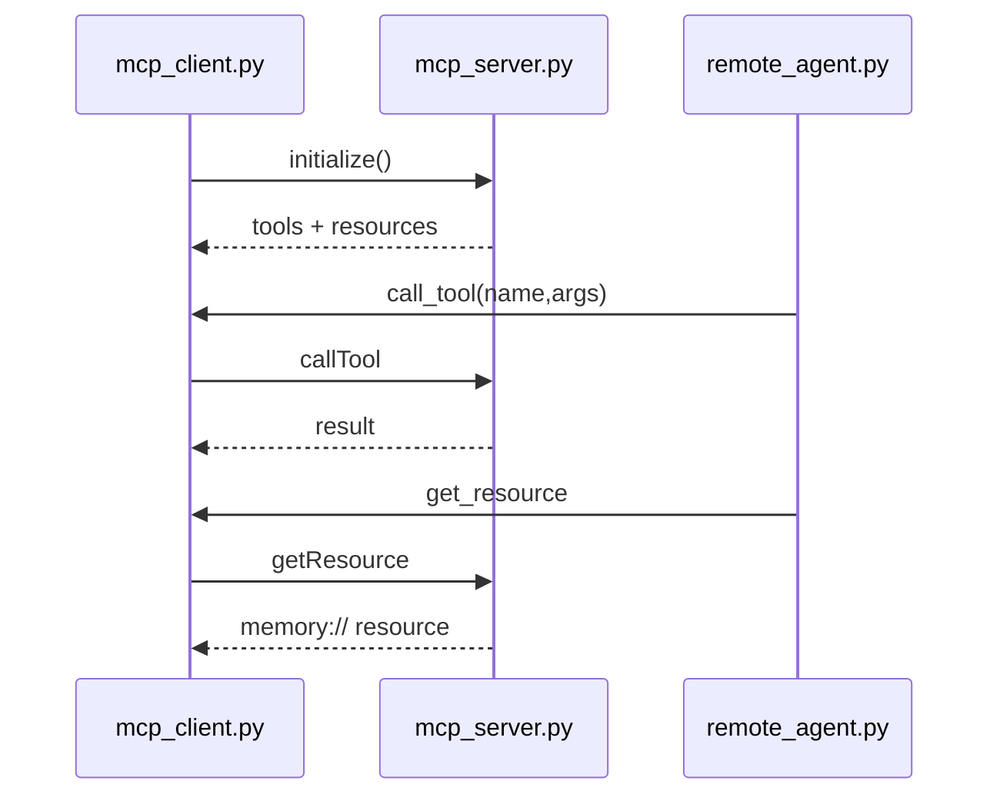
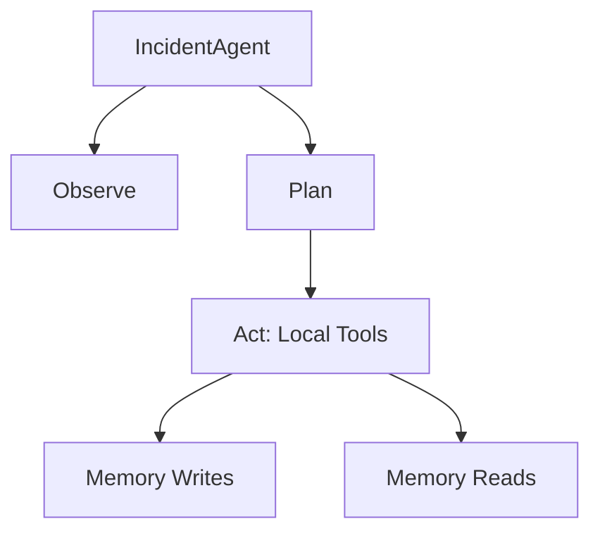

<table width="100%">
<tr>
<td style="vertical-align: top;">

<h1>Week 04 Capstone - Agentic Incident Command</h1>

<p>
Primary submission artifact: 
</p>

<ul>
<li>Remote MCP agent path - the primary graded submission path, using JSON-RPC over WebSockets to communicate with the MCP server.</li>
<li>Local deterministic agent path - supporting evidence for debugging, replay, and reviewer validation only.</li>
<li>Shared telemetry system - every OPAL phase logs structured JSONL to the Week 4 <code>artifacts/</code> directory.</li>
</ul>

</td>

<td align="right" width="200">

</td>

</tr>
</table>

## Submission Scope

The primary graded artifact for Week 04 is `02_incident_command_agent/`. It
includes the remote MCP-backed Incident Command Agent, OPAL loop execution,
telemetry/replay support, and generated artifacts in `artifacts/`.
`01_tool_harness/` and local CLI utilities are supporting components.

## 1. Architecture 

### System Architecture
```text
+---------------------------+        JSON-RPC / MCP         +------------------------------+
|  memory:// resources      | <---------------------------> |  Remote Incident Agent       |
|  - alerts/latest          |                               |  - Observe                   |
|  - runbooks/index         |                               |  - Plan                      |
|  - deltas/recent          |                               |  - Act                       |
|  - plans/current          |                               |  - Learn                     |
+-------------+-------------+                               +---------------+--------------+
              |                                                             |
              v                                                             v
      +------------------+                                         +----------------------+
      |   MCP Server     |                                         |  Telemetry Logger    |
      |   tools/resources|                                         |  artifacts/*.jsonl   |
      +------------------+                                         +----------+-----------+
                                                                                |
                                                                                v
                                                                   +-------------------------+
                                                                   | Replay + sample_summary |
                                                                   +-------------------------+
```
This diagram shows the primary graded remote MCP path, including resources,
OPAL phases, telemetry, and replayable artifacts.

### A. OPAL Loop


### B. MCP Client-Server Flow


### C. Local Deterministic Tool Flow


---

## 2. Module-by-Module Summary

```text
capstones/week04_agentic_incident_command/
├── 01_tool_harness/  # warm-up harness
│   ├── README_tool_harness.md
│   ├── mcp_tool_harness_client.py
│   ├── mcp_tool_harness_server.py
│   ├── schemas.py
│   ├── telemetry.py
│   └── samples/
├── 02_incident_command_agent/
│   ├── cli.py
│   ├── config.py
│   ├── config.yaml  # read-only documentation mirror of config.py
│   ├── conftest.py
│   ├── demo_remote.py
│   ├── incident_agent.py
│   ├── incident_memory.py
│   ├── incident_planner.py
│   ├── incident_schemas.py
│   ├── mcp_client.py
│   ├── mcp_server.py
│   ├── remote_agent.py
│   ├── replay.py
│   ├── telemetry.py
│   ├── test_integration.py
│   └── test_tools.py
└── artifacts/
    ├── sample_summary.md
    └── telemetry.jsonl
```

`config.yaml` is a documentation/portability mirror only; it is not loaded at
runtime. `config.py` is the sole runtime source of truth.

---

## 3. Key Features

### Primary Graded Path
The remote MCP flow is the submission artifact. The local `incident_agent.py`
path mirrors the same OPAL loop in-process and is supporting evidence for
deterministic replay and reviewer validation only:

- `mcp_server.py` exposes tools and resources over WebSockets.
- `mcp_client.py` connects to `ws://127.0.0.1:8765/mcp` through the shared config surface in `config.py`.
- `remote_agent.py` observes MCP resources, plans locally, acts through RPC, and writes Learn-phase deltas back to memory.

### Adaptive Planning
`incident_planner.py` is observation-driven. It does not return a fixed 5-step plan.

- CPU, memory, spike, high -> `retrieve_runbook` -> `run_diagnostic` -> `summarize_incident`
- deploy, crash, pod, fail -> `retrieve_runbook` -> `summarize_incident`
- otherwise -> fallback to the CPU/memory path

The planner also derives step arguments from `alerts_latest`, so the payloads stay inspectable in telemetry.

### Deterministic Tools
Local and remote tools return predictable synthetic envelopes with:

```json
{ "status": "ok", "data": {...}, "metrics": { "latency_ms": X }}
```

### Telemetry Everywhere
Each OPAL phase emits:

- `observe_start/end`
- `plan_start/end`
- `act_start/end`
- `learn_start/end`
- `rpc_send/recv` (remote only)

Telemetry is written to `capstones/week04_agentic_incident_command/artifacts/telemetry.jsonl` through the shared `TELEMETRY_SINK` in `config.py`.

Replay enables deterministic reconstruction of the OPAL loop from telemetry
logs for inspection, debugging, and audit without re-executing the system:

```bash
python capstones/week04_agentic_incident_command/02_incident_command_agent/cli.py --replay capstones/week04_agentic_incident_command/artifacts/telemetry.jsonl
```

`correlation_id` on the client side spans all rpc_send/recv and OPAL phase events for one run; `loop_id` identifies the OPAL loop within that trace.

## 4. Auditability


- Replayability: `capstones/week04_agentic_incident_command/artifacts/telemetry.jsonl` contains the full event stream, including `phase`, `method`, `status`, `latency_ms`, `budget`, and `payload` for each step.
- Guarded transitions: Observe -> Plan -> Act -> Learn is recorded with explicit `*_start` and `*_end` events, and `plan_guardrail` / `act_guardrail` events mark truncation or stop conditions.
- Review surfaces: reviewers can inspect budgets, tool request and response payloads, the selected plan, executed step results, and memory surfaces such as `memory://alerts/latest`, `memory://runbooks/index`, `memory://plans/current`, `memory://deltas/recent`, `memory://incidents/{id}`, and `memory://evidence/{id}`.
- Remote Learn now persists `memory://plans/current` before `learn_end`, so the same run's trace shows the plan write in-band.
- Single-run isolation: the client and server each generate their own `correlation_id` per session. To isolate one execution, filter by `loop_id: "loop-1"` or by the client-side `correlation_id` (all `rpc_send`/`rpc_recv`/`observe_*`/`plan_*`/`act_*`/`learn_*` events carry it). Server-side `observe`/`act` events carry the server's own session ID; they can be joined to the client trace via the `id` field in the request payload.
- Deterministic evidence: the evidence set comes from fixtures, memory resources, and telemetry logs, not RNG seeds.

## 5. Verification

From the repo root:

The demo runners archive any existing `artifacts/telemetry.jsonl` to a timestamped `telemetry_YYYYMMDD_HHMMSS.jsonl` file before writing new events, so prior runs are preserved instead of overwritten.

### Server Startup
Terminal A:
```bash
python capstones/week04_agentic_incident_command/02_incident_command_agent/mcp_server.py
```

### Remote MCP Run
Terminal B:
```bash
python capstones/week04_agentic_incident_command/02_incident_command_agent/demo_remote.py
```

### Replay
```bash
python capstones/week04_agentic_incident_command/02_incident_command_agent/cli.py --replay capstones/week04_agentic_incident_command/artifacts/telemetry.jsonl
```

### Handler Tests
```bash
pytest capstones/week04_agentic_incident_command/02_incident_command_agent/test_tools.py
```

### Supporting Deterministic Run
```bash
python capstones/week04_agentic_incident_command/02_incident_command_agent/cli.py
```

### Integration Test
```bash
pytest capstones/week04_agentic_incident_command/02_incident_command_agent/test_integration.py
```

---

## 6. Guardrails

- `Budget(tokens=2000, ms=150, dollars=0.0)` is centralized in `config.py`
- `max_steps = 5`
- `max_retries = 2`
- Cumulative latency tracked per OPAL loop
- Guardrail events: `plan_guardrail`, `act_guardrail`

---

## 7. Human Handoff Output

After each remote OPAL loop, `demo_remote.py` writes `artifacts/sample_summary.md` — a markdown document containing the correlation ID, alert ID, the executed plan steps with arguments, the triage summary text, and the recommended runbook actions.

This file is the escalation artifact an on-call engineer receives. If the agent cannot resolve the incident (e.g. an `act_guardrail` fires on latency or retries), the last written `sample_summary.md` plus `memory://deltas/recent` provide full context for human takeover. The summary is structured so it can be pasted directly into an incident ticket.

---

## 8. Known Limitations

- **Telemetry logging is file-based (no internal rotation).**  
  `TelemetryLogger` appends to `artifacts/telemetry.jsonl` without a built-in size cap.  
  The demo runner mitigates this by archiving any existing file to a timestamped  
  `telemetry_YYYYMMDD_HHMMSS.jsonl` before each run. This keeps runs isolated and replayable.

- **Planner is rule-based (no cross-loop learning).**  
  The planner selects tool paths from observation keywords (e.g., CPU/memory vs deploy/crash).  
  Each OPAL loop replans from scratch; no persistent policy update or learning across loops is implemented.  
  This is intentional to keep the decision logic transparent and auditable.

- **Remote Learn persistence is best-effort.**  
  The Learn phase attempts to persist a memory delta via `append_memory_delta`.  
  If the server is unreachable or the write fails, the error is treated as non-fatal and the loop completes.  
  Telemetry still captures the full execution trace for offline inspection and replay.
