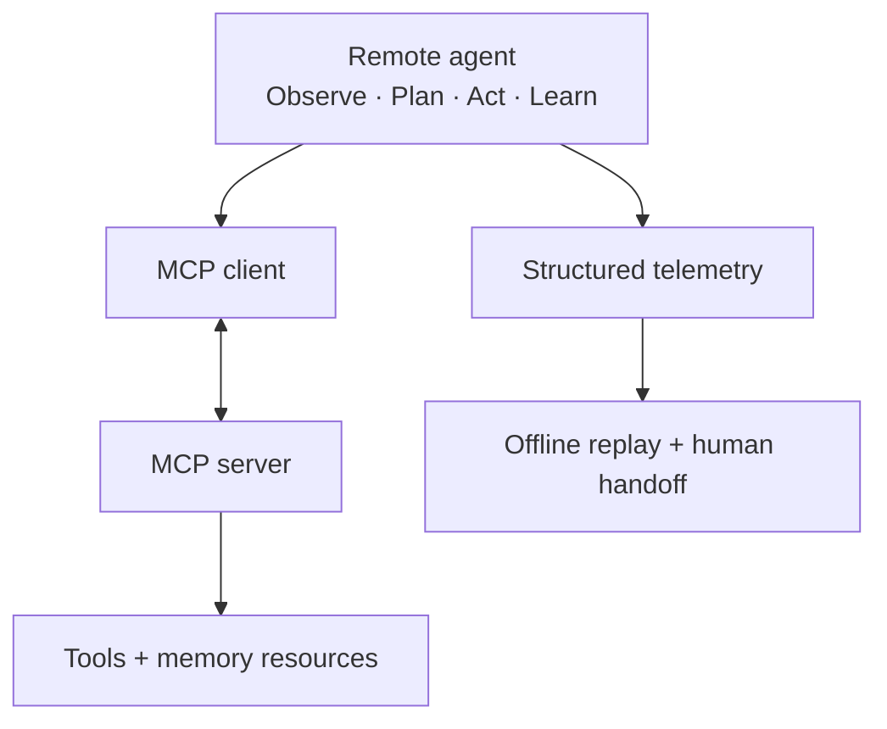

# Week 04 Capstone: Agentic Incident Command

An auditable incident-response agent built around an **Observe–Plan–Act–Learn (OPAL)** loop and an MCP-style client/server workflow.

The primary submission is the remote agent in [`02_incident_command_agent/`](02_incident_command_agent/). It communicates with the MCP server over JSON-RPC/WebSockets, loops until the incident is `resolved` or `escalated`, invokes tools under explicit guardrails, writes structured telemetry, and produces a human-readable incident handoff.

---

## Submission Overview

| Surface | Role |
| --- | --- |
| [`demo_remote.py`](02_incident_command_agent/demo_remote.py) | Primary remote MCP demonstration |
| [`mcp_server.py`](02_incident_command_agent/mcp_server.py) | Tools, resources, memory, and server-side budgets |
| [`remote_agent.py`](02_incident_command_agent/remote_agent.py) | OPAL orchestration, multi-loop run, terminal states |
| [`incident_loop.py`](02_incident_command_agent/incident_loop.py) | Shared loop logic: diagnostic fixtures, outcome assessment, Learn notes |
| [`telemetry.jsonl`](artifacts/telemetry.jsonl) | Replayable two-loop execution trace (reference trace) |
| [`sample_summary.md`](artifacts/sample_summary.md) | Human escalation handoff (reference) |
| [`memory_snapshot.json`](artifacts/memory_snapshot.json) | Server memory at the end of the run: alert, deltas, plan, telemetry snapshot |

The local deterministic agent and `01_tool_harness/` are supporting validation components rather than the primary submission path.

---

## Architecture


```mermaid
flowchart TD
    A["Remote agent<br/>Observe · Plan · Act · Learn"] --> B["MCP client"]
    B <--> C["MCP server"]
    C --> D["Tools + memory resources"]
    A --> E["Structured telemetry"]
    E --> F["Offline replay + human handoff"]
```

Each incident run is a sequence of OPAL loops (`loop-1`, `loop-2`, …), and each loop has its own correlation ID that is sent to the server, so client and server events share it:

1. **Observe:** capabilities, the latest alert, the runbook index, recent memory deltas, and the telemetry snapshot (`memory://telemetry/snapshot`).
2. **Plan:** a rule-based planner picks tools. From the second loop on it reads the earlier loops' deltas and cites them in each step's `rationale` and `cites_deltas`.
3. **Act:** tools run under step, millisecond, token and failure guardrails.
4. **Learn:** the plan is stored and a delta is written: `Diagnosed <service>, ran <command>, outcome <verdict>: <result>`, with `alert_id` and an ISO-8601 UTC timestamp.

The run ends in one of two terminal states:

- `resolved`: a diagnostic came back `healthy`.
- `escalated`, with an `escalation_reason`: the planner decides the evidence is still inconclusive after the runbook lookup and every known check (`evidence_inconclusive_after_runbook_check`); or the loop budget ran out (`ms_budget_exceeded`, `token_budget_exceeded`); or `max_loops` (3) was hit (`max_loops_reached`, a backstop). The agent then writes the handoff summary.

The committed scenario is deterministic: loop 1 runs `kubectl top pod` (inconclusive), loop 2 reads that delta plus the runbook and runs one further check (`kubectl logs …`, degraded). No known check remains, so the planner's `plan_decision` after loop 2 is `escalate` and the run ends `escalated` after two of the three allowed loops.

`config.py` is the runtime source of truth. `config.yaml` is retained as a documentation and portability mirror only.

**Local execution is canonical.** The Colab path below is documented, not exercised in this repo.

---

## Run the Submission

Run all commands from the repository root with the project environment activated.

### 1. Start the MCP server

Start a fresh server for every run: server memory is in-process, and a second run against the same server would see the first run's deltas.

Terminal A:

```bash
python capstones/week04_agentic_incident_command/02_incident_command_agent/mcp_server.py
```

### 2. Run the remote agent

Terminal B:

```bash
python capstones/week04_agentic_incident_command/02_incident_command_agent/demo_remote.py
```

**These run steps regenerate the committed artifacts.** The demo archives any existing `artifacts/telemetry.jsonl` as `telemetry_<timestamp>.jsonl`, then rewrites:

- `artifacts/telemetry.jsonl`
- `artifacts/sample_summary.md`
- `artifacts/memory_snapshot.json`

The committed copies are the reference trace. Correlation IDs and timestamps differ on every run; everything else is deterministic. Restore the reference with `git checkout -- capstones/week04_agentic_incident_command/artifacts` before committing.

### 3. Replay the recorded trace

```bash
python capstones/week04_agentic_incident_command/02_incident_command_agent/cli.py \
  --replay capstones/week04_agentic_incident_command/artifacts/telemetry.jsonl
```

### 4. Run the complete Week 4 test suite

```bash
pytest capstones/week04_agentic_incident_command/02_incident_command_agent/
```

---

## Validation Evidence

The submitted snapshot was validated with:

- **42 automated tests passed**
- Successful remote MCP client/server execution
- **103 replayable telemetry events** across **2 complete loops** (`loop-1`, `loop-2`, of a maximum of 3), each with its own correlation ID on both client and server events
- Complete Observe–Plan–Act–Learn lifecycle in each loop; the run ends `escalated` by planner decision (`evidence_inconclusive_after_runbook_check`)
- Loop 2's plan cites loop 1's memory delta
- Evidence-grounded incident summary and recommended actions
- A memory snapshot next to the trace

The supplied [`telemetry.jsonl`](artifacts/telemetry.jsonl), [`sample_summary.md`](artifacts/sample_summary.md) and [`memory_snapshot.json`](artifacts/memory_snapshot.json) provide the inspectable submission evidence.

---

## Guardrails and Budgets

Each loop starts with a fresh budget: `2000` tokens, `150 ms`, and `0.0` dollars.

- Maximum plan length: `5` steps
- Maximum failed tool calls: `2` (no retry after a failed call)
- Maximum loops per incident: `3` (`loop_guardrail` event, then `escalated`); a backstop, since the planner decides earlier
- **Tokens:** every tool debits its advertised `cost_hint_tokens` (10, 15, 20, 5, 5, 3, 3, 3 for the eight tools). The agent stops the loop and escalates when tokens reach 0.
- **Milliseconds:** every tool debits the `latency_ms` it reports. Those latencies are **fixture values** (5, 7, 6 ms, …) set in the tools, not wall-clock measurements. The 150 ms limit is our own budget choice. The agent stops and escalates when milliseconds reach 0.
- **Dollars:** not tracked. There is no paid model or tool, so `cost_dollars` is always `0.0` and nothing enforces a dollar limit.
- Explicit `plan_guardrail`, `act_guardrail` and `loop_guardrail` telemetry events.

Budget fields in the trace are labelled by owner (`budget_owner`):

- `agent`: the per-loop budget above. Client events report the same object, and the logger never debits it.
- `server`: the server's own session budget, debited with the same per-tool token cost and the server's measured wall time.

Phase-end events report the real outcome: `act_end` is `ok`, `error` (a step failed) or `guardrail_stop`. The server labels every call with the OPAL phase and loop ID the client sends in `_meta`.

---

## Optional Colab Path

Local execution is canonical. This path is documented, **not exercised in this repo**; nothing here was run on Colab.

1. **Host the server in Colab.** Upload `02_incident_command_agent/` (or clone the repo), install `websockets`, and run `mcp_server.py` in a cell with `asyncio` (e.g. `!python mcp_server.py &`). The server listens on port `8765`.
2. **Tunnel port 8765.** Colab has no inbound access, so expose the port with `cloudflared tunnel --url http://localhost:8765` or `ngrok http 8765`. Use the `wss://…` URL the tunnel prints.
3. **Point the local agent at the tunnel.** Set `MCP_SERVER_URI` in `config.py` to the tunnel URL (keep the `/mcp` path), or pass `uri=` to `MCPClient`. Then run `demo_remote.py` locally as usual.
4. **Keep artifacts on Google Drive.** Mount Drive in Colab (`drive.mount('/content/drive')`) and point `ARTIFACTS_DIR` in `config.py` at a folder there. Use the same folder, synced locally, so `cli.py --replay` reads the trace.
5. **Limitations.** Colab sessions time out and stop background processes; there is no system-package access (no `apt` installs for the tunnel binary without extra setup); tunnel URLs change each session; and secrets (ngrok tokens) belong in Colab secrets, never in the notebook or repo.

---

## How to Extend the Agent

- **Add a tool.** (1) Add its JSON schema to `get_tool_schemas()` and its description, `latency_hint_ms` and `cost_hint_tokens` to `_TOOL_META` in `incident_schemas.py`. (2) Write a handler in `mcp_server.py` that returns `_envelope(..., cost_tokens=tool_cost_tokens("<name>"))` and route it in `call_tool`. (3) Add it to `test_tools.py` and to the cost test in `test_incident_loops.py`. (4) Have the planner emit a step for it.
- **Add a resource.** Add its URI and schema to `get_resource_schemas()`, serve it in `get_resource()` (server) or `IncidentMemoryStore.get_resource()` (memory), and read it in `RemoteIncidentAgent.observe()`. `memory://telemetry/snapshot` is the worked example.
- **Add a planner state.** In `IncidentPlanner.plan()`, add an incident class in `_classify_incident()` and a `tool_sequence` for it, or a new branch driven by `_prior_loop_deltas()`. Put its verdict in `incident_loop.py` so both agents share it, and add a test that checks the plan.

---

## Scope and Limitations

This capstone prioritizes transparency, deterministic validation, and auditability over production-scale infrastructure:

- Tools and incident data are deterministic fixtures.
- Planning is rule-based. It reads earlier loops' deltas within a run, but nothing persists between runs.
- Server memory is in-process and single-tenant; restart the server between runs.
- Diagnostics return deterministic fixture output; no command is executed.
- Telemetry is file-based rather than database-backed.
- Learn-phase memory writes are best-effort.
- Tool validation covers required fields, primitive types, and integer bounds rather than complete nested JSON Schema enforcement.

These constraints keep the agent behavior inspectable while identifying clear directions for production hardening.
